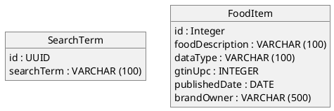
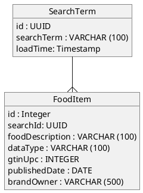

# DataFlattener
This project provides the parser for files with `.mapper` extension.

## What is a Mapper file?
Mapper is a DSL designed to be easily read, understood, written and parsable to communicate source to target mapping. Lets understand this through an example. 

1.  We'll start with a JSON dataset (SOURCE) with a schema. 
2.  We, then, write a source to target mapping in form of `.mapper` file to flatten the JSON to relational tables (TARGET).


### Example Dataset: FoodData Central Dataset Schema
For the example set, I wantemad to select a somewhat complex structure (but of course, not too complex) to understand how to easily communicate the flattening effort - especially when one record is responsible for producing rows going into multiple tables. Following is the source schema we are going to deal with. The dataset is inspired from FoodData Central. Check them out, pretty cool!

```
root
 |-- currentPage: long
 |-- foodSearchCriteria: struct
 |    |-- generalSearchInput: string
 |    |-- pageNumber: long
 |    |-- requireAllWords: boolean
 |-- foods: array
 |    |-- element: struct
 |    |    |-- additionalDescriptions: string
 |    |    |-- allHighlightFields: string
 |    |    |-- brandOwner: string
 |    |    |-- commonNames: string
 |    |    |-- dataType: string
 |    |    |-- description: string
 |    |    |-- fdcId: long
 |    |    |-- foodCode: string
 |    |    |-- gtinUpc: string
 |    |    |-- ingredients: string
 |    |    |-- ndbNumber: string
 |    |    |-- publishedDate: string
 |    |    |-- scientificName: string
 |    |    |-- score: double
 |-- totalHits: long
 |-- totalPages: long
```

This dataset is the response given by the FoodData Central api when I asked for all the food that matched my search criteria. So, when I asked for "baking powder" I get following response. `foodSearchCriteria.generalSearchInput` mentions just that - "baking powder". `foods` is the list of food items that matched my search criteria. Each food item has a FoodData Central database unique number in `fdcId` along with other food related information.

```json
{
    "foodSearchCriteria": {
        "generalSearchInput": "baking powder",
        "pageNumber": 1,
        "requireAllWords": false
    },
    "totalHits": 2,
    "currentPage": 1,
    "totalPages": 1,
    "foods": [
        {
            "fdcId": 563346,
            "description": "BAKING POWDER",
            "dataType": "Branded",
            "gtinUpc": "039978033925",
            "publishedDate": "2019-04-01",
            "brandOwner": "Bob's Red Mill Natural Foods, Inc.",
            "ingredients": "SODIUM ACID PYROPHOSPHATE, SODIUM BICARBONATE, CORNSTARCH, AND MONOCALCIUM PHOSPHATE.",
            "allHighlightFields": "",
            "score": 863.32733
        },
        {
            "fdcId": 592185,
            "description": "BAKING POWDER",
            "dataType": "Branded",
            "gtinUpc": "07789045049",
            "publishedDate": "2019-04-01",
            "brandOwner": "Wegmans Food Markets, Inc.",
            "ingredients": "CORN STARCH, SODIUM BICARBONATE, MONOCALCIUM PHOSPHATE.",
            "allHighlightFields": "",
            "score": 863.32733
        }
    ]
}
```

## Source to Target Mapping using Mapper file
Now that we have the dataset we want to decide how we want to map it to relational tables. That requires coming up with **reporting requirements**. 

### Requirement 1: Food and Search Dimension
Capture all the food search terms made by users in a dimensional table. Also, capture food items in a dimensional table. 



| id                                   | searchTerm    |
|--------------------------------------|---------------|
| 1fa0ddee-ad3c-a426-347b-637cb3621442 | baking powder |
            


| id     | foodDescription | dataType | gtinUpc      | publishedDate | brandOwner                         |
|--------|-----------------|----------|--------------|---------------|------------------------------------|
| 563346 | BAKING POWDER   | Branded  | 039978033925 | 2019-04-01    | Bob's Red Mill Natural Foods, Inc. |
| 592185 | BAKING POWDER   | Branded  | 07789045049  | 2019-04-01    | Wegmans Food Markets, Inc.         |

#### Source-to-Target Mapping (.mapper)

```
TABLE SearchTerm (
    MAPPING(
        to_uuid(foodSearchCriteria.generalSearchInput)      = id            UUID            NOT NULL    PK
        foodSearchCriteria.generalSearchInput               = searchTerm    VARCHAR (100)   NOT NULL
    )
)

TABLE FoodItem FROM foods (
    MAPPING(
        fdcId           = id                 INT                NOT NULL    PK
        description     = foodDescription    VARCHAR (100)      NULL
        dataType        = dataType           VARCHAR (100)      NOT NULL
        gtinUpc         = gtinUpc            INTEGER            NOT NULL
        publishedDate   = publishedDate      DATE               NULL
        brandOwner      = brandOwner         VARCHAR (500)      NOT NULL
    )
)
```

##### Explaination
```
TABLE SearchTerm (
    MAPPING(
        to_uuid(foodSearchCriteria.generalSearchInput)      = id            UUID            NOT NULL    PK
        foodSearchCriteria.generalSearchInput               = searchTerm    VARCHAR (100)   NOT NULL
    )
)
```

Here we are defining source to target mapping configuration for table `SearchTerm`. All the mappings are defined inside `MAPPING` clause surrounded by open/close parenthesis. Let's look at the first mapping.

```to_uuid(foodSearchCriteria.generalSearchInput)      = id            UUID            NOT NULL    PK```

Here we are saying:
> _Convert the value `foodSearchCriteria.generalSearchInput` to a guid using the function `to_uuid` because column data type `UUID`. The result of conversion will go as value for `id` column in `SearchTerm` table. Also this value cannot be NULL denoted by `NOT NULL` clause as it is a primary key column denoted by `PK`._

Now let look at the second mapping

```foodSearchCriteria.generalSearchInput               = searchTerm    VARCHAR (100)   NOT NULL```

Here we are saying:
>_Use the value `foodSearchCriteria.generalSearchInput` as a VARCHAR (100) for the column `searchTerm` in table `SearchTerm`. Also this value cannot be NULL denoted by `NOT NULL` clause._

Now lets look at the mapping configuration for `FoodItem`.

```
TABLE FoodItem FROM foods (
    MAPPING(
        fdcId           = id                 INT                NOT NULL    PK
        description     = foodDescription    VARCHAR (100)      NULL
        dataType        = dataType           VARCHAR (100)      NOT NULL
        gtinUpc         = gtinUpc            INTEGER            NOT NULL
        publishedDate   = publishedDate      DATE               NULL
        brandOwner      = brandOwner         VARCHAR (500)      NOT NULL
    )
)
```

Everything in the mapping section follows the same logic as described above. The only difference is `FROM food` part. `FROM` section of the config denotes what **array** type property of the JSON yields the rows for this table. In this case it is the property `foods` in the json dataset. Mappings defined communicate traversal logic with respect to the schema of the each element in the `foods` collection. In other words, the value of `id` column is demonstrated by `fdcId` - instead of `foods.fdcId`.

### Requirement 2: Search-Result Log Book
Capture the response in the relational model where a dimensional table holding the search and a child table that contains all the food items received for that response.



| id                                   | searchTerm    | loadTime                     |
|--------------------------------------|---------------|------------------------------|
| 1fa0ddee-ad3c-a426-347b-637cb3621442 | baking powder | Sun Feb  2 12:45:39 EST 2020 |


| foodId | searchId                             | foodDescription | dataType | gtinUpc      | publishedDate | brandOwner                         |
|--------|--------------------------------------|-----------------|----------|--------------|---------------|------------------------------------|
| 563346 | 1fa0ddee-ad3c-a426-347b-637cb3621442 | BAKING POWDER   | Branded  | 039978033925 | 2019-04-01    | Bob's Red Mill Natural Foods, Inc. |
| 592185 | 1fa0ddee-ad3c-a426-347b-637cb3621442 | BAKING POWDER   | Branded  | 07789045049  | 2019-04-01    | Wegmans Food Markets, Inc.         |

#### Source-to-Target Mapping (.mapper)

```
TABLE SearchTerm (
    MAPPING(
        to_uuid(foodSearchCriteria.generalSearchInput)      = id            UUID            NOT NULL    PK
        foodSearchCriteria.generalSearchInput               = searchTerm    VARCHAR (100)   NOT NULL
        current_timestamp()                                 = loadTime      TIMESTAMP       NOT NULL
    )

    TABLE FoodItem FROM foods (
        MAPPING(
            fdcId           = id                 INT                NOT NULL    PK
            foreign_key()   = searchId           UUID               NOT NULL    FK
            description     = foodDescription    VARCHAR (100)      NULL
            dataType        = dataType           VARCHAR (100)      NOT NULL
            gtinUpc         = gtinUpc            INTEGER            NOT NULL
            publishedDate   = publishedDate      DATE               NULL
            brandOwner      = brandOwner         VARCHAR (500)      NOT NULL
        )
    )
)
```

##### Explaination
`FoodItem` mapping configuration is embedded inside the `SearchTerm` mapping configuration to define parent-child relationship. `FROM` field is a JSON key of type array which gets used to create the content for the child table. In this case, child table `FoodItem` is made from array field `foods` from root.

```
TABLE SearchTerm (
    MAPPING(
        . . .
    )

    TABLE FoodItem FROM foods (
        MAPPING (
            . . .
        )
    )
)
```

---
**NOTE**

Notice the mappings for child table `FoodItems` do **not** start with `foods` prefix, i.e `foods.fdcId` vs `fdcId`. Since `food` is already mentioned in the FROM field clause - its implied. We simply demonstrate our mapping effort from the element level itself.

---